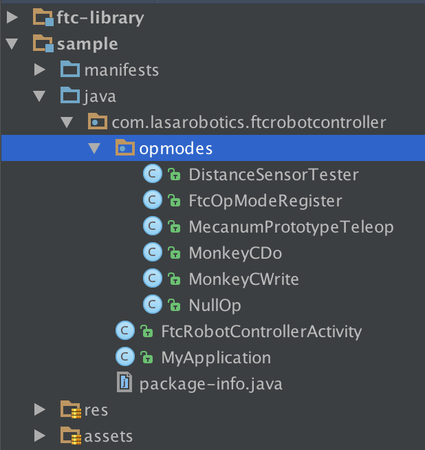

# FTC Android Library   

##Introduction
Welcome to the FTC Android Library! **The goal of this library is to provide a clean, well documented and easy to use library to help all FTC teams.** We encourage you to look around, try out the library, and **submit any issues you find**. For those new to using libraries in Android, we've included a friendly guide below.

We *strongly encourage* FTC teams to submit pull requests to this library. You will be helping other teams too! (For details on the pull request process and *important guidelines*, see the Contributing section at the bottom of this page.

##Getting Started
###Download Android Studio
Android Studio is the IDE used for developing Android apps. It is available for Windows, OSX and most Linux distributions and can be downloaded from [here](http://developer.android.com/sdk/index.html).

###Get the project
The most recent stable version of FTCLibrary can be found on [this page](https://github.com/lasarobotics/FTCLibrary/releases). Simply download the attached archive and extract it anywhere on your computer. Alternatively, you can clone the repository in git or browse to a specific branch to view development versions.

###Open the Project
From the Android Studio menu, select `Open an existing Android Studio Project` and browse to the location of the library. Android Studio will begin running setup and generate the necessary files to use the library. Once done, you should see a `samples` modules such as the one shown here.

**You can now begin editing the `opmodes` in the sample module to code your robot with the library!** (We've included samples in the `samples/` folder for you to play with.)

##Documentation  

**Documentation for the entire stable API is available at ftclib.lasarobotics.org.** 

##Support
We can provide support to teams who wish to use our library. Please let us know (via the issues tab) if there's anything we can help you with or anything you wish could be improved. We welcome feedback!

##Contributing
Help in any and all areas is welcomed and encouraged. If you would like to help, please fork the library and pull request changes into the `dev` branch.

**Thank you to the following teams for their participation and use of the library!**
- **HIgh PHidelity (4290)**
- **Ultra Violet (5998)**
- **Static Void (6990)**

With :heart: and GitHub,

LASA Robotics
